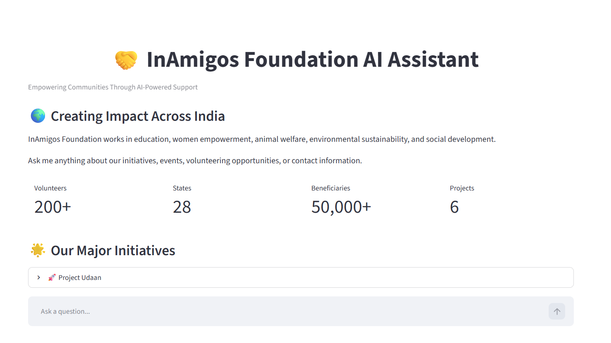
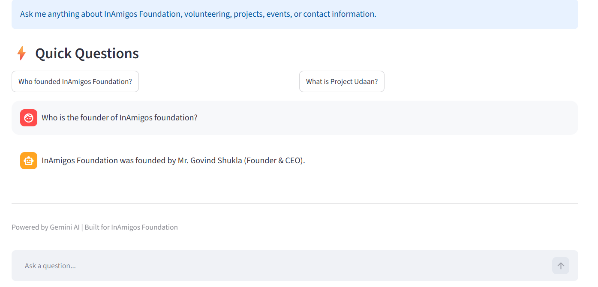
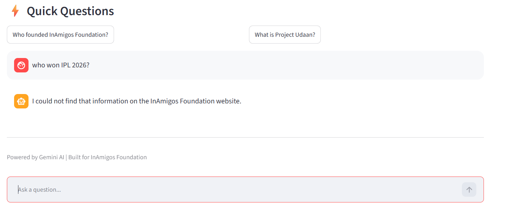

# 🤝 InAmigos AI Assistant

## Overview

InAmigos AI Assistant is an AI-powered chatbot developed using Python, Google's Gemini API, Streamlit, and Prompt Engineering techniques.

The chatbot answers user queries based exclusively on information extracted from the official InAmigos Foundation website. It is designed to provide accurate, context-aware responses while preventing hallucinations and unrelated answers.

This project was developed as part of an Industry-Oriented Generative AI internship project focused on Prompt Engineering and AI Application Development.

---

## Problem Statement

Organizations receive numerous queries related to their services, initiatives, contact information, and support activities. Handling these queries manually increases response time and operational effort.

This project demonstrates how Generative AI can be used to automate customer support by providing accurate and domain-specific responses through carefully designed prompts.

---

## Objective

To build a Generative AI-powered chatbot that:

* Answers NGO-related questions accurately
* Uses prompt engineering to control responses
* Supports multi-turn conversations
* Handles unknown queries safely
* Provides a user-friendly web interface

---

## Features

### Core Features

* NGO-specific Question Answering
* Gemini API Integration
* Prompt Engineered Responses
* Multi-turn Conversation Support
* Conversation Logging
* Streamlit Frontend
* Website Data Extraction
* Unknown Query Handling

### User Interface Features

* Modern Streamlit Dashboard
* Sidebar Information Panel
* Quick Question Buttons
* Impact Statistics Cards
* Project Information Sections
* Chat History Memory
* Clear Chat Functionality

---

## Technology Stack

| Technology         | Purpose                 |
| ------------------ | ----------------------- |
| Python             | Backend Development     |
| Gemini API         | Large Language Model    |
| Streamlit          | Frontend Interface      |
| BeautifulSoup      | Website Data Extraction |
| Requests           | Web Scraping            |
| Python-dotenv      | API Key Management      |
| Prompt Engineering | Response Control        |

---

## System Architecture

Website Data
↓
Web Scraping
↓
Text Extraction
↓
Knowledge Base (ngo_data.txt)
↓
Prompt Engineering
↓
Gemini API
↓
Response Generation
↓
Streamlit Frontend

---

## Project Workflow

### Step 1: Website Scraping

The system extracts content from the official InAmigos Foundation website.

### Step 2: Text Processing

Relevant information is cleaned and stored inside a local knowledge base.

### Step 3: User Query Processing

The user's question is combined with:

* System Prompt
* NGO Knowledge Base
* Conversation History

### Step 4: Response Generation

Gemini generates responses using the provided NGO context.

### Step 5: Fallback Handling

If information is unavailable:

"I could not find that information on the InAmigos Foundation website."

### Step 6: Conversation Logging

All interactions are saved for future analysis.

---

## Prompt Engineering Strategy

The chatbot uses a carefully designed system prompt to control model behavior.

### System Rules

1. Answer ONLY using NGO information.
2. Be professional and concise.
3. Do not invent information.
4. Use conversation history for follow-up questions.
5. Trigger fallback response when information is unavailable.

### Benefits

* Reduces hallucinations
* Improves response accuracy
* Maintains domain-specific behavior
* Enhances user trust

---

## Prompt Design for Different User Intents

| User Intent         | Example Query                          | Response Strategy                        |
| ------------------- | -------------------------------------- | ---------------------------------------- |
| Founder Information | Who founded InAmigos Foundation?       | Retrieve founder details from NGO data   |
| Project Information | What is Project Udaan?                 | Return project-specific information      |
| Contact Information | How can I contact InAmigos Foundation? | Return official contact details          |
| Volunteer Queries   | How can I volunteer?                   | Provide volunteering-related information |
| Event Queries       | What events are conducted?             | Return event-related information         |
| Unknown Queries     | Who won IPL 2026?                      | Trigger fallback response                |

---

## Multi-Turn Conversation Handling

The chatbot maintains recent conversation history using Streamlit Session State.

This enables:

* Follow-up questions
* Context awareness
* Improved user experience

Example:

User: Who founded InAmigos Foundation?

Bot: Govind Shukla founded InAmigos Foundation.

User: When was it founded?

Bot: The foundation was established on September 23, 2020.

---

## Response Quality Evaluation

| Test Query                       | Expected Result               | Actual Result              | Status |
| -------------------------------- | ----------------------------- | -------------------------- | ------ |
| Who founded InAmigos Foundation? | Govind Shukla                 | Correct Response           | PASS   |
| What is Project Jeev?            | Animal Welfare Information    | Correct Response           | PASS   |
| What is Project Udaan?           | Women Empowerment Information | Correct Response           | PASS   |
| How can I contact the NGO?       | Contact Details               | Correct Response           | PASS   |
| Who won IPL 2026?                | Fallback Response             | Correct Fallback Triggered | PASS   |

### Evaluation Summary

The chatbot successfully:

* Answers domain-specific queries
* Rejects unrelated questions
* Maintains conversational context
* Produces reliable responses

---

## Fallback Handling

For questions outside the NGO knowledge base, the chatbot responds:

"I could not find that information on the InAmigos Foundation website."

Example:

User: Who won IPL 2026?

Bot: I could not find that information on the InAmigos Foundation website.

---

## Project Structure

```text
inamigos-ai-assistant/
│
├── app.py
├── chatbot.py
├── scrape.py
├── extract.py
├── ngo_data.txt
├── requirements.txt
├── .gitignore
├── README.md
└── screenshots/
```

## Installation

### Clone Repository

```bash
git clone https://github.com/Varun-CIT/inamigos-ai-assistant.git
cd inamigos-ai-assistant
```

### Install Dependencies

```bash
pip install -r requirements.txt
```

### Create Environment File

Create a `.env` file:

```env
GEMINI_API_KEY=YOUR_API_KEY
```

### Run Application

```bash
streamlit run app.py
```

---

## Sample Questions

* Who founded InAmigos Foundation?
* What is Project Udaan?
* What is Project Jeev?
* How many beneficiaries has the NGO served?
* How can I contact the NGO?
* What initiatives does the NGO run?

---
## Screenshots

### Home Page



### Founder Query



### Project Information


### Fallback Handling


-----
## Future Enhancements

* Retrieval-Augmented Generation (RAG)
* Vector Database Integration
* PDF Document Support
* Volunteer Registration Assistant
* Live Website Synchronization
* Source Citations
* Admin Dashboard

---

## Internship Requirements Mapping

| Requirement                    | Status      |
| ------------------------------ | ----------- |
| Business Domain Selection      | ✅ Completed |
| Prompt Design for User Intents | ✅ Completed |
| System Prompt Structure        | ✅ Completed |
| Context Handling               | ✅ Completed |
| Multi-turn Conversations       | ✅ Completed |
| Response Evaluation            | ✅ Completed |
| Fallback Handling              | ✅ Completed |
| API Integration                | ✅ Completed |
| Conversation Logging           | ✅ Completed |
| Prompt Strategy Documentation  | ✅ Completed |

Project Completion: **100%**

---

## Author

**Varun B**

Developed as part of an Industry-Oriented Generative AI Internship Project.

## License

This project is intended for educational and internship demonstration purposes.
